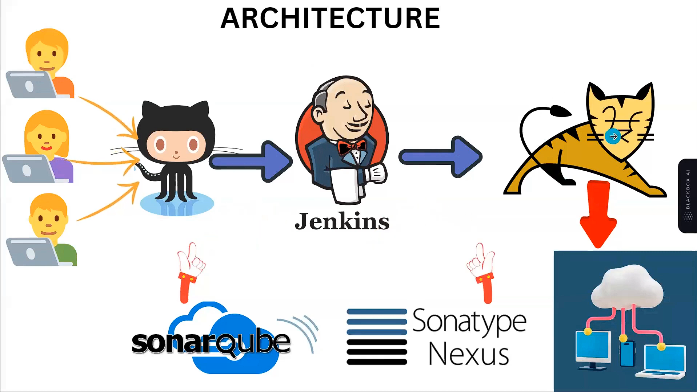

# Hi there 👋, I'm Singhadi27!

Welcome to my GitHub profile!  
I'm passionate about technology, open source, and building impactful software.

## 🚀 About Me

- 👨‍💻 Mobile App Developer using Flutter & DevOps Engineer  
- 🌱 Currently exploring new technologies and contributing to open source.  
- 🤝 Always open to connecting with like-minded developers and creators.

## 🛠️ Tech Stack

- **Languages:** C++, Dart, SQL  
- **Frameworks:** Flutter  
- **DevOps:** CI/CD, Cloud & Automation Tools (Jenkins, AWS, Docker, Kubernetes, Terraform, SonarQube)

## 🔧 DevOps Workflow

Here’s a quick visual of the DevOps tools and pipeline I work with:

> *(Image shows Jenkins + GitHub + Maven + SonarQube + Docker + Kubernetes + AWS EC2 + Monitoring)*

## ⭐ Featured Projects

| Project | Description | Tech |
| ------- | ----------- | ---- |
| [LocalVue](https://github.com/Singhadi27/loacalvue) | Discover and book local events (music, poetry, qawwali) | Flutter, Dart, Firebase |
| [KrishiLink](https://github.com/Singhadi27/krishilinkapp) | Empowering farmers with crop listings and real-time price tracking | Flutter, Dart, Firebase |

## 📫 How to reach me

- LinkedIn: [adityasinghio](https://www.linkedin.com/in/adityasinghio/)

## ⚡ Fun Facts

- 🚀 Always eager to learn and try out the latest in tech and DevOps  
- 🎮 Coding, collaborating, and problem-solving are my passions  

---

Thank you for visiting my profile!  
Let's connect and create something amazing together 🚀
